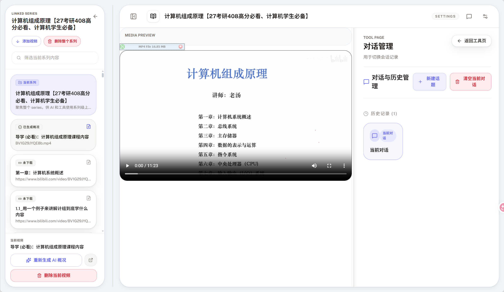
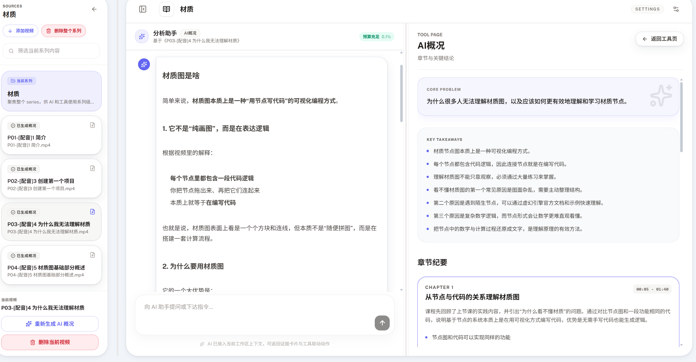
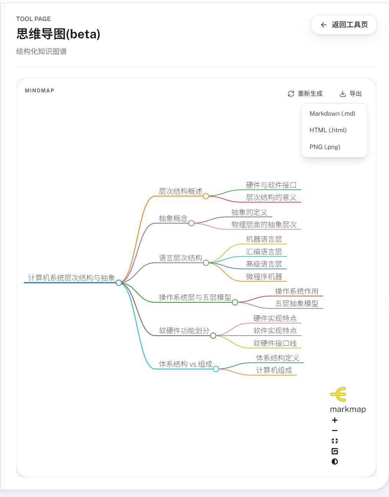
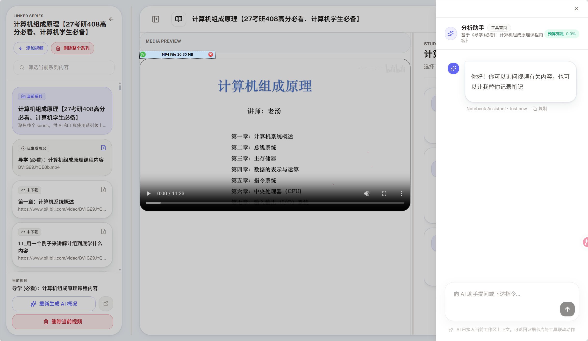

<div align="center">


# vsummary

视频AI总结，对话的本地知识库工具


</div>


---

## 功能展示

### 系列对话



### 视频 AI 概况

在 AI 概况里，**点击章节卡片**或展开后的**转写段**即可直接跳到视频对应时间并自动播放。


### 视频播放器

播放器始终位于工作区中栏，章节跳转后自动播放；没选视频时显示「选择视频以开始预览」占位。



### 思维导图

基于 AI 概况自动生成交互式 SVG 思维导图，支持缩放、拖拽、节点折叠/展开。单视频导图按知识结构组织，系列级导图跨视频提炼知识脉络。



- **交互式 SVG 渲染** — 基于 markmap（d3.js），支持滚轮缩放、拖拽平移、节点折叠/展开
- **单视频思维导图** — 基于转写文本 + AI 概况自动生成层级化知识结构
- **系列级全局导图** — 跨视频提炼知识脉络，按主题合并重复知识点
- **实时进度上报** — 生成过程通过 SSE 推送进度，显示已用时间
- **多格式导出** — 支持 Markdown（.md）、HTML（自包含 markmap 页面）、PNG（高清截图）
- **Agent 一键触发** — 在对话中可直接让助手打开或生成思维导图

### 聊天抽屉

点击工具栏的 💬 按钮从右侧滑出分析助手；按 `Esc` 或点击背景即可关闭。播放器继续播放，不被打断。



---

## 核心特性

- **把视频变成可检索的知识库**：导入本地视频后，自动整理出转写文本、概况、章节和关键结论。后续可以直接围绕内容提问，把视频作为自己的本地知识库。支持导出为MD。
- **按系列管理学习资料**：适合课程、讲座、播客、会议录像等成组视频。你可以在一个系列里批量处理视频，并从系列视角理解整体内容。
- **交互式思维导图**：基于 AI 概况自动生成 SVG 思维导图，支持缩放、拖拽、节点折叠。单视频按知识结构组织，系列级跨视频提炼全局脉络。支持导出 MD / HTML / PNG 三种格式，生成过程实时显示 SSE 进度。
- **单个视频深度阅读**：每个视频都有独立工作区，可以查看原视频、AI 概况、章节摘要、思维导图、知识卡片和笔记，适合精读一段长视频。
- **章节与转写一键跳转**：在 AI 概况中，**点击章节卡**或展开后的**任意转写段**即可直接跳到视频对应时间并自动播放，导航视频内容更直观。
- **中栏始终是视频播放器**：进入任意视频后，中栏就是播放器；未选中视频时显示「选择视频以开始预览」占位。`AI 概况`、`思维导图`、`知识卡片`、`笔记`等独立工具页在右侧并列展示。
- **分析助手按需唤起**：原本固定在中间的"分析助手"聊天面板被收进工具栏的 💬 抽屉——需要提问时点开，关闭后中栏播放器立即可用。`Esc` 或点击背景都能关闭。
- **围绕视频内容对话**：可以在单视频或整个系列范围内提问，让系统基于已经整理好的转写、摘要、笔记和知识卡片回答。
- **外部课程导入**：支持 Bilibili 外链导入，也支持通过 `chaoxing-downloader` 导入超星学习通课程。
- **本地优先**：原始视频、转写结果、摘要、笔记和知识索引都保存在本地目录中；除了调用你配置的模型供应商外，不需要把视频上传到第三方平台。
- **低门槛启动**：提供 CPU / GPU 两种整合包，普通用户下载整合包解压后运行 `start.bat` 即可使用

---

## 快速开始


### 方式 A：下载整合包

1. 打开 [GitHub Releases](https://github.com/alpha03123/vsummary/releases)。
2. 根据机器选择对应压缩包：
   - 普通电脑或没有 NVIDIA 显卡：下载 CPU 版。
   - NVIDIA 显卡并希望加速本地转写：下载 GPU 版。
3. 解压压缩包到本地目录。
4. 进入前端从设置界面设置api key等设置（推荐）。或者复制 `.env.example` 为 `.env`并且修改`config\settings.toml`，填写模型供应商配置
5. 双击 `start.bat` 启动。
6. 浏览器打开 [http://127.0.0.1:4173](http://127.0.0.1:4173)。

整合包已经内置 Python 环境、FFmpeg、后端依赖和前端构建产物，不需要再安装 Conda 或 Node.js。

### 方式 B：下载源码

源码运行前请先准备：

| 工具 | 用途 | 下载地址 |
|------|------|----------|
| Miniconda 或 Anaconda | 管理 Python 环境和依赖 | https://www.anaconda.com/download/success |
| Node.js 18+ | 运行前端界面 | https://nodejs.org |

推荐使用 **Miniconda/Anaconda Prompt** 进行初始化与启动。

#### 1. 创建 Conda 环境

在项目根目录执行：

```bat
conda env create -f environment.yml
conda activate vsummary
```

这会自动安装：

- Python 3.11
- FFmpeg
- 后端依赖

#### 2. 安装前端依赖

```bat
cd src\frontend
npm install
cd ..\..
```

#### 3. 准备本地视频

将你要处理的视频文件放到本地后，通过前端界面的：

- `添加系列`
- `添加视频`
- `添加 Playground 视频`

进行本地导入。

#### 4. 复制 `.env`

复制 `.env.example` 为 `.env`，再填写模型供应商配置：

```dotenv
OPENAI_API_KEY=sk-你的密钥
OPENAI_PROVIDER=openai_compatible
OPENAI_BASE_URL=https://api.deepseek.com
OPENAI_MODEL=deepseek-v4-flash
```

说明：

- `OPENAI_BASE_URL` 可以写成：
  - `https://api.deepseek.com`
  - `https://api.deepseek.com/v1`
- 程序会自动补齐并归一为 `/v1`
- 最终实际请求由后端统一拼到 `chat/completions`

#### 5. 配置 HuggingFace 镜像

如果你所在网络环境无法稳定访问 HuggingFace，请在 `.env` 里继续加入：

```dotenv
HF_ENDPOINT=https://hf-mirror.com
```


#### 6. 首次启动后检查 `config/settings.toml`

程序第一次运行后会生成 `config/settings.toml`。推荐重点检查这两段：

```toml
[asr.faster_whisper]
device = "auto"
model_size = "large-v3-turbo"
compute_type = "float16"
transcription_mode = "accurate"

[agent_retrieval]
embedding_provider = "fastembed"
embedding_model = "BAAI/bge-small-zh-v1.5"
embedding_device = "gpu"
embedding_batch_size = 8
```

说明：

- `device` 控制 **视频转写（fast whisper模型）** 用 CPU 还是 NVIDIA GPU（建议GPU）
- `embedding_device` 控制 **RAG 向量检索模型** 用 CPU 还是 GPU（默认 GPU）

#### 7. 启动服务

##### 一键启动

直接双击根目录下的 `start.bat`。

##### 手动启动

**终端 1：后端**

```bat
cd src
conda run -n vsummary python -m uvicorn backend.api.app:app --host 127.0.0.1 --port 8001
```

**终端 2：前端**

```bat
cd src\frontend
npm run dev
```

启动后访问：

- 前端：[http://127.0.0.1:4173](http://127.0.0.1:4173)
- 后端：[http://127.0.0.1:8001](http://127.0.0.1:8001)

---
## GPU 说明

### 视频转写 GPU

如果你有 NVIDIA 显卡，并且希望启用视频转写 GPU 加速，可以：

```toml
[asr.faster_whisper]
device = "gpu"
```

### CUDA 11 用户


如果你的机器仍然停留在 CUDA 11，建议：

1. 优先使用 CPU 模式
2. 或尝试把 `environment.yml` 中默认的 CUDA 12 运行时包改成 CUDA 11 对应包
```yaml
- nvidia-cublas-cu11
- nvidia-cudnn-cu11
- nvidia-cuda-runtime-cu11
- nvidia-cuda-nvrtc-cu11
```


### RAG / embedding GPU

默认依赖使用 `fastembed-gpu` 和 `onnxruntime-gpu`，`embedding_device` 默认使用：

```toml
embedding_device = "gpu"
```

如果使用 CPU 整合包或没有 NVIDIA GPU，可以改回：

```toml
embedding_device = "cpu"
```


---

## 数据目录

- `videos/`：原始视频文件
- `workspace/`：转写、概况、笔记等工作产物
- `data/models/`：本地模型文件

除了发给 LLM 供应商的文本请求外，原始音视频处理都保留在本地。

---

## 常见问题

### 1. `cublas.dll not found` / `cudart64_12.dll` / `cudnn` 报错

说明当前 GPU 运行时没有就绪。

建议顺序：

1. 确认你是通过 `environment.yml` 创建环境
2. 确认后端是从这个环境启动的
3. 如果还不行，先改回 CPU：

```toml
[asr.faster_whisper]
device = "cpu"
```

### 2. 只有 CUDA 11

当前默认环境走的是 **CUDA 12**。如果你必须使用 CUDA 11，可以尝试把 `environment.yml` 中的以下依赖改为 CUDA 11 对应包：

```yaml
- nvidia-cublas-cu11
- nvidia-cudnn-cu11
- nvidia-cuda-runtime-cu11
- nvidia-cuda-nvrtc-cu11
```


### 3. HuggingFace 下载很慢 / 失败

在 `.env` 中加入：

```dotenv
HF_ENDPOINT=https://hf-mirror.com
```

然后重启后端。

### 4. RAG GPU 初始化失败

说明当前 FastEmbed GPU 运行时没有就绪，或环境安装的是 CPU 版 embedding 依赖。

请改回：

```toml
[agent_retrieval]
embedding_device = "cpu"
```


### 5. 如何更换转写语言

修改：

```toml
[asr]
language = "zh"
```

改成你需要的语言代码即可。
