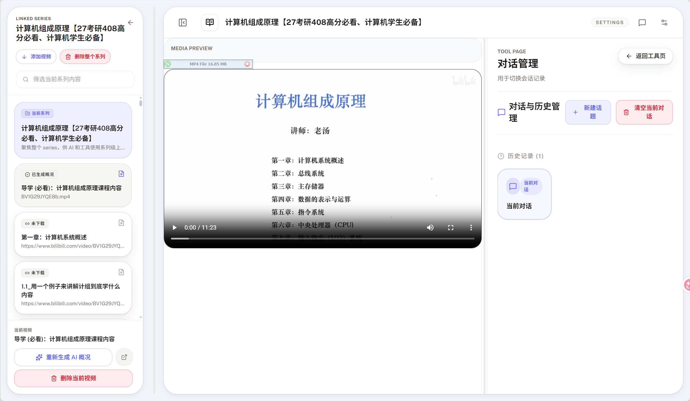
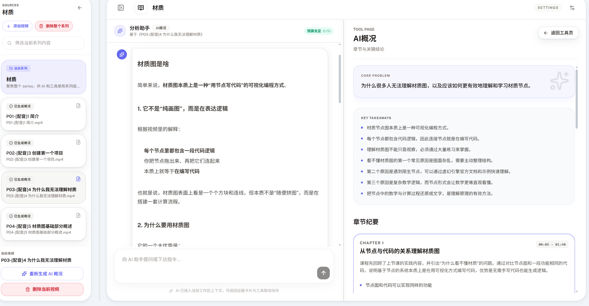
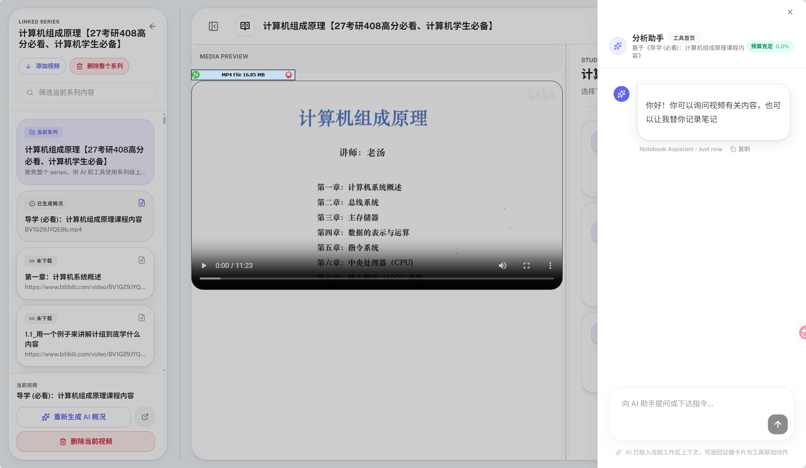
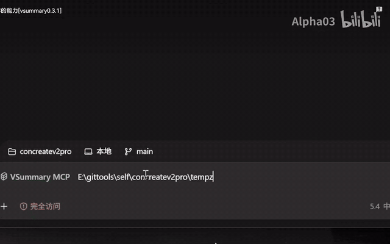
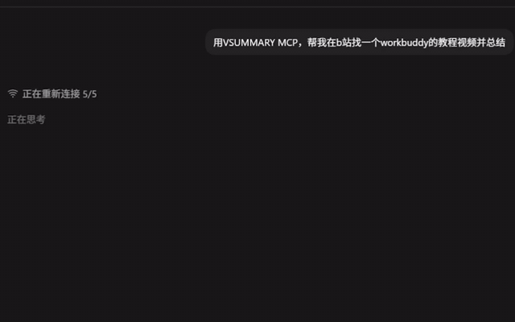

# vsummary

视频AI总结，对话的本地知识库工具

---

## 功能展示

### 系列对话

### 视频 AI 概况

在 AI 概况里，**点击章节卡片**或展开后的**转写段**即可直接跳到视频对应时间并自动播放。

### 视频播放器

播放器始终位于工作区中栏，章节跳转后自动播放；没选视频时显示「选择视频以开始预览」占位。

### 聊天抽屉

点击工具栏的 💬 按钮从右侧滑出分析助手；按 `Esc` 或点击背景即可关闭。播放器继续播放，不被打断。

### MCP：整理本地录音

将 VSummary 接入 MCP 后，AI 助手可以创建系列、导入本地媒体、发起处理并导出 Markdown。下面演示将两段录音处理为一份可编辑的结构化总结。

### MCP：自主探索 Bilibili

AI 助手可以先检索 Bilibili 内容，再将选中的视频交给 VSummary 下载、转写和生成概况；处理完成后可继续读取和整理导出的内容。

---

## 核心特性

- **把视频变成可检索的知识库**：导入本地视频后，自动整理出转写文本、概况、章节和关键结论。后续可以直接围绕内容提问，把视频作为自己的本地知识库。支持导出为MD。
- **按系列管理学习资料**：适合课程、讲座、播客、会议录像等成组视频。你可以在一个系列里批量处理视频，并从系列视角理解整体内容。
- **单个视频深度阅读**：每个视频都有独立工作区，可以查看原视频、AI 概况、章节摘要、思维导图、知识卡片和笔记，适合精读一段长视频。
- **章节与转写一键跳转**：在 AI 概况中，**点击章节卡**或展开后的**任意转写段**即可直接跳到视频对应时间并自动播放，导航视频内容更直观。
- **中栏始终是视频播放器**：进入任意视频后，中栏就是播放器；未选中视频时显示「选择视频以开始预览」占位。`AI 概况`、`思维导图`、`知识卡片`、`笔记`等独立工具页在右侧并列展示。
- **分析助手按需唤起**：原本固定在中间的"分析助手"聊天面板被收进工具栏的 💬 抽屉——需要提问时点开，关闭后中栏播放器立即可用。`Esc` 或点击背景都能关闭。
- **围绕视频内容对话**：可以在单视频或整个系列范围内提问，让系统基于已经整理好的转写、摘要、笔记和知识卡片回答。
- **外部课程导入**：支持 Bilibili 外链导入，也支持通过 `chaoxing-downloader` 导入超星学习通课程。
- **MCP 自动化工作流**：通过 MCP 工具让 AI 助手创建和管理视频系列，导入本地媒体或 Bilibili 链接，跟踪处理进度，并导出 Markdown。
- **本地优先**：原始视频、转写结果、摘要、笔记和知识索引都保存在本地目录中；除了调用你配置的模型供应商外，不需要把视频上传到第三方平台。
- **低门槛启动**：提供 CPU / GPU 两种整合包，普通用户下载整合包解压后运行 `start.bat` 即可使用

---

## 快速开始

- [安装、硬件与 ASR 配置](docs/installation.md)：Windows NVIDIA、Windows AMD、macOS 的环境、模型与启动方式。

## 数据目录

- `videos/`：原始视频文件
- `workspace/`：转写、概况、笔记等工作产物
- `data/models/`：本地模型文件

除了发给 LLM 供应商的文本请求外，原始音视频处理都保留在本地。

---

## 常见问题

常见问题见 [docs/questions.md](docs/questions.md)。
## 沟通和联系
- QQ群:点击链接加入群聊【vsummary交流沟通群】：https://qm.qq.com/q/nxKBApDVF
