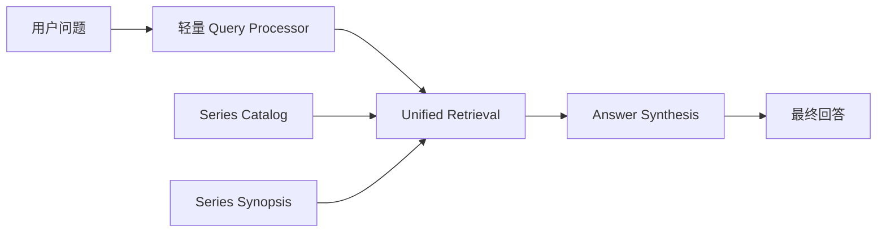

# Series Scope RAG 架构复盘与重构蓝图

## 1. 目标

本文用于复盘当前 `series scope` Agent 链路为什么会出现：

- 首问极慢
- 回答偏短、偏保守
- 很多问题只走 `summary`
- planner / retrieval / answer 职责重叠

并结合联网查到的官方资料，给出一套可审阅的重构蓝图。

本文聚焦 **series scope**。  
`video scope` 当前虽然也有可优化点，但结构性问题没有 `series scope` 这么严重。

---

## 2. 外部资料结论

### 2.1 Router / Query Planning 的适用场景

查到的资料基本一致指出：`router` / `query planning` 的典型场景是 **多数据源、多索引、多检索后端之间的路由选择**，而不是在一个单系列视频库里反复调度同一批 summary / transcript。

参考：

- Microsoft Learn, *Build advanced RAG systems*  
  <https://learn.microsoft.com/en-us/azure/developer/ai/advanced-retrieval-augmented-generation>

- LlamaIndex, *Routing*  
  <https://docs.llamaindex.ai/en/stable/module_guides/querying/router/>

核心结论：

1. Router 更像“多知识源入口选择器”
2. 如果知识库本身是单一语料域，router 不一定是默认正确答案
3. Router 的收益建立在“不同 retriever / query engine 有明显边界”之上

---

### 2.2 Classic RAG 在“简单、低延迟、单知识库”场景下更合适

Microsoft 的官方文档明确提到：

- **Classic RAG** 组件更少
- 链路更简单
- 速度更快
- 因为 retrieval 阶段没有额外的 LLM query planning

参考：

- Microsoft Learn, *RAG in Azure AI Search*  
  <https://learn.microsoft.com/en-us/azure/search/retrieval-augmented-generation-overview>

相关结论：

1. 如果重点是低延迟、低复杂度，classic RAG 更合适
2. Agentic retrieval 适合复杂多源问题，不是所有项目都需要
3. “是否需要 planner”本身就是一个成本问题，而不是默认前提

---

### 2.3 统一检索 summary + transcript 是合理做法，但不应预设固定权重

官方资料并不要求把 summary / transcript 拆成多条 graph 执行链。  
Azure 的 retrieval 文档明确支持：

- 多字段检索
- hybrid retrieval
- rerank
- 必要时 query rewrite / subqueries

参考：

- Microsoft Learn, *Information retrieval phase*  
  <https://learn.microsoft.com/en-us/azure/architecture/ai-ml/guide/rag/rag-information-retrieval>

这说明：

1. `summary` 和 `transcript` 可以放进同一个统一检索体系
2. 区别应该主要体现在 **document 粒度和 metadata**，而不是必须拆成多个执行节点
3. “统一检索 + hybrid retrieval + rerank + metadata”是正路
4. 不应先验写死“summary 低权重 / transcript 高权重”；更合理的是让 query、metadata、reranker 决定哪些证据排前面

---

### 2.4 层级化 / 递归检索的正确打开方式

LlamaIndex 的 `RecursiveRetriever` 和 RAPTOR 都指向一个重要思路：

- 可以做层级化知识组织
- 可以做 small-to-big 检索
- 但关键是 **统一语料组织与递归证据展开**
- 不是先让一个 planner 把全量证据读一遍，再派发给 retrieval

参考：

- LlamaIndex, *Recursive Retriever*  
  <https://docs.llamaindex.ai/en/stable/api_reference/retrievers/recursive/>

- RAPTOR 论文  
  <https://arxiv.org/abs/2401.18059>

对当前项目的启发：

1. `summary_global` / `summary_chapter` / `transcript_chunk` 可以是层级证据
2. 但 retrieval 应该围绕“按需召回”展开
3. 不能在 planner 阶段就把高层证据几乎全读完

---

## 3. 对当前 series scope 的根因诊断

### 3.1 当前链路并不是“RAG 太弱”，而是“planner 抢了 retrieval 的职责”

当前 `series scope` 的链路可以简化描述成：

1. `build_plan`
2. `SeriesPlanner.create_plan()`
3. `execute_summary / execute_video_graph / execute_video_workflow`
4. `SeriesAggregator.answer`

表面看像多阶段协作，实质上：

- `planner` 已经读了全系列大量 summary 信息
- `execute_summary` 又重新检索 summary
- `answer` 再重新组织答案

所以这条链路不是“各层各司其职”，而是 **重复读、重复筛、重复总结**。

---

### 3.2 `SeriesPlanner` 过重

当前 `SeriesPlanner.create_plan()` 会：

1. 遍历系列所有视频
2. 对每个视频调用 `get_video_summary()`
3. `get_video_summary()` 还会进一步把 transcript segment 切片并挂回 chapter
4. 把 enriched summary 拼成 catalog 发给 LLM
5. 让 LLM 输出：
   - `selected_videos`
   - `selection_mode`
   - `subplans`
   - `depth`

这一步的根问题：

1. **planner 已经拿到了高层证据**
2. **planner 已经在做候选筛选**
3. **planner 已经部分沾到了 transcript**
4. 后面的 retrieval 就失去了“按需取证”的意义

换句话说：

> 不是 retrieval 太少，而是 planner 已经看太多了。

---

### 3.3 `execute_summary` 慢，不是因为“读 summary 文件慢”

当前 profile 已经验证：

- 时间大头集中在 `graph.invoke`
- 首次 `execute_summary` 非常慢

根因在 `SeriesRetrievalService._get_or_build_index()`：

1. 首次检索时会建 LanceDB 索引
2. 会把 summary / transcript / notes / cards 都做 embedding
3. 还会重建整个 index

这属于 **把初始化成本压在用户首问上** 的生命周期设计错误。

用户感知上就会变成：

- 问一个“这个系列讲了啥”
- 结果先花一分钟以上建索引

这是结构问题，不是参数问题。

---

### 3.4 路由偏保守，导致“只走 summary”

当前 planner prompt 和 subplan 约束会鼓励下面这种行为：

- 概括 / 筛选 / 比较 -> 优先走 `summary`
- 只有细粒度定位 / 原话 / 时间点 -> 才走 `video_graph`
- 流程才走 `video_workflow`

于是像：

- “Copilot 模式是啥”
- “这个系列讲了啥”
- “JManus 和 AgentScope 有什么区别”

这种问题，系统很容易只出一个 `summary` subplan。

结果就是：

1. 检索很浅
2. 答案缺乏 transcript 级支撑
3. 用户感觉像“模型爱答不理”

---

### 3.5 当前 series graph 的复杂度没有换来质量

这是最关键的判断。

当前链路里有：

- classifier
- planner
- subplans
- summary node
- video graph node
- workflow node
- aggregator
- memory carry-forward

但这些复杂度并没有换来：

- 更低延迟
- 更深证据
- 更自然回答

因此，这不是“小修小补”的级别，而是 **架构方向需要收缩**。

---

## 4. 是否需要大型重构

结论：**需要，但方向不是“继续加节点”，而是“砍链路、减职责、保留真正有价值的模块”。**

具体来说，不建议继续沿着当前 `series planner -> subplans -> execute_*` 这条路线堆修补逻辑。

因为这样只会：

1. 修一个边缘 case
2. 新增一层分支
3. 让整体更难理解
4. 继续保留“planner 抢 retrieval 工作”的根病

---

## 5. 推荐的重构方向

### 5.1 总原则

把 `series scope` 从“多阶段自治 graph orchestration”降级成：

**Series Catalog + Unified Retrieval + Answer Synthesis**

而不是：

**Planner + Selected Videos + Subplans + Multi-step Execute Graph**

---

## 5.2 新的三层结构

### A. Series Catalog / Series Synopsis 层

拆成两个轻量对象：

1. **Series Catalog**
2. **Series Synopsis**

#### Series Catalog

只负责提供轻量级目录信息：

- `video_id`
- `title`
- `one_sentence_summary`
- `chapter_titles`
- `processed`
- 可选 tags

注意：

1. 这里不拼 transcript_segments
2. 不让 LLM 直接基于全量 enriched summary 做规划
3. 只给 retrieval 和 answer 提供轻量目录视图

#### 字段来源纠偏

这里需要明确区分 **真实已有字段**、**派生字段**、**理想化示例字段值**。

当前仓库中，视频级 summary 的结构化 schema 已经固定为：

- `title`
- `one_sentence_summary`
- `core_problem`
- `chapters`
- `key_takeaways`

对应代码：

- `SummaryPayload` 定义于  
  `src/backend/video_summary/infrastructure/structured_generation/schemas.py`
- 结构化 summary prompt 定义于  
  `src/backend/video_summary/infrastructure/structured_generation/prompts.py`
- summary 生成主流程位于  
  `src/backend/video_summary/infrastructure/litellm_summarizer.py`

这意味着：

1. `one_sentence_summary` 是 **模型直接生成的真实结构化字段**
2. `chapter_titles` 不是当前 summary 文件中的顶层字段，而应视为 **由 `chapters[*].title` 派生出的 catalog 视图字段**
3. 在 `video scope` 运行时，当前代码已经会从 `summary.summary["chapters"]` 中提取 `chapter_titles`，对应代码位于  
   `src/backend/agent/infrastructure/workspace_context_loader.py`

因此，未来设计 `Series Catalog` 时应当坚持：

1. `one_sentence_summary` 可以直接复用 summary 资产中的真实字段
2. `chapter_titles` 必须由 `chapters[*].title` 机械提取，不应让模型再额外重复生成一份
3. 文档、调试样例、验收样例中的 `chapter_titles` 必须标明它是 **派生字段**

另外还要补一条边界认知：

- 当前 `one_sentence_summary`、`core_problem`、`chapters[*].title` 虽然都基于 transcript 生成，因此**有依据**
- 但它们不是 transcript 的逐字抽取，而是 LLM 的结构化归纳结果，因此不能把它们误当成“零推断事实”
- 对 overview 问题，这类高层资产完全合理
- 对概念解释、定位、比较、原话、时间点问题，最终仍应优先回到 transcript 级证据

#### Series Synopsis

预计算一份 `series_overview.json`，更准确地说，它应被视为一个 **series 级 synthetic high-level retrieval document**，建议包含：

- 系列一句话主线
- 主题分组
- 建议学习脉络
- 每节的一句话摘要

用途：

1. 解决“这个系列讲了啥”“这个系列怎么学”这类 overview 问题
2. 作为 unified retrieval 的高层补充证据
3. 降低 overview 问题对 transcript 深检索的依赖

注意：

- `series synopsis` 不是替代 retrieval，而是作为 **统一检索中的 series 级高层摘要文档**
- 对概念解释、比较、定位、流程问题，仍应回到统一证据检索

#### 生成时机与可用性策略

建议采用：

**一个视频处理完成后，后台异步触发一次 synopsis 增量更新。**

而不是：

1. 每处理完一个视频就同步阻塞重算
2. 等整个系列全部处理完才第一次生成

推荐策略：

1. 当某个视频的 `summary` 首次生成或更新时，给对应 series 打上 `synopsis_stale` 标记
2. 后台异步任务重新生成该 series 的 synopsis
3. 在后台生成期间，用户依然可以正常询问 series 问题
4. 如果此时 synopsis 还是旧的：
   - 优先使用旧 synopsis
   - 并补充最新已存在的 `summary_global / summary_chapter`
   - 必要时继续回退到 unified retrieval
5. 如果 synopsis 尚不存在：
   - 直接从 unified retrieval 回答
   - 同时后台异步创建 synopsis

这意味着：

- **即使 synopsis 正在重建，series 问答也应该保持可用**
- synopsis 是加速器和高层语料，不是 series 能否回答的硬前提

---

### B. Unified Retrieval 层

统一索引所有证据，但保留粒度和类型：

- `series_synopsis`
- `summary_global`
- `summary_chapter`
- `transcript_chunk`
- 可选 `notes`

统一 metadata：

- `series_id`
- `video_id`
- `source_type`
- `chapter_title`
- `start_seconds`
- `end_seconds`

检索时：

1. 不再区分 `execute_summary` / `execute_video_graph` / `execute_video_workflow`
2. 使用一个统一检索器
3. 通过 query rewrite / rerank / metadata 决定召回结果

这才是 RAG 最自然的工作方式。

---

### C. Answer Synthesis 层

回答模型只做一件事：

**基于已经召回的证据，组织最终回答。**

注意：

1. 不建议把回答层做成硬编码的“五类问题模板机”
2. 更合理的是：
   - 保持统一的 synthesis prompt
   - 根据 query understanding 和召回证据动态组织答案
   - 必要时只调整少量回答策略，而不是固定死模板

---

## 5.3 Router 要不要保留

建议保留一个 **极轻量 Query Processor**，更准确地说，是一层 **query preprocessing / query transformation**，但不再保留当前重型 `SeriesPlanner`。

它只做：

- query rewrite
- query expansion
- 必要时 query decomposition
- retrieval 参数 hint

它不再做：

- `selected_videos`
- `selection_mode`
- `subplans`
- `target_video_ids`

也就是说：

> router 只指导 retrieval，不再编排执行图。

---

## 6. 推荐的最终查询链路



说明：

1. Query Processor 不读全量 summary，不负责选视频
2. Catalog 只是辅助过滤和增强
3. Series Synopsis 是 overview 类问题的高层辅助语料
4. Retrieval 是真正的证据入口
5. Answer 只基于召回结果输出

---

## 7. 对典型问题的处理方式

### 7.1 “这个系列讲了啥”

建议：

1. 优先召回 `series_synopsis`
2. 再补多个视频的 `summary_global + summary_chapter`
3. transcript 可以参与，但是否排前应由 query / rerank 决定，而不是硬编码降权
4. Answer 输出：
   - 系列总览
   - 主题分组
   - 学习脉络

不需要 planner 先读一遍全系列 summary 再决定怎么查。

---

### 7.2 “Copilot 模式是啥”

建议：

1. `series_synopsis` / `summary` 帮助命中相关视频与概念背景
2. transcript chunk 提供细节解释
3. 回答时可以自然组织成：
   - 定义
   - 在系列脉络里的位置
   - 和 Agent 模式的区别

而不是只从一个 summary 里拿一句定义。

---

### 7.3 “哪一节讲过 Nacos 3”

建议：

1. Unified retrieval 命中：
   - `summary_chapter`
   - `transcript_chunk`
2. Answer 输出视频标题 + 大致位置 + 原意说明

这里 transcript 应该主导。

---

## 8. 迁移蓝图

### 阶段 1：先止血

目标：解决最致命的体验问题。

1. 查询时不再建索引
2. 把索引构建前移到数据生成/更新阶段
3. planner 不再调用 enriched `get_video_summary()` 构建大 catalog

收益：

- 首问延迟大幅下降
- planner 阶段明显变轻

---

### 阶段 2：下掉重型 `SeriesPlanner`

目标：去掉最核心的冗余复杂度。

1. 删除 `selected_videos / selection_mode / subplans` 协议
2. 删除 `target_video_ids` 驱动的多节点执行方式
3. 引入轻量 `SeriesQueryProcessor`

收益：

- 路由逻辑更清晰
- 不再有 planner 抢 retrieval 工作
- 不再需要 index/ref/index-video_id 这类复杂输出合同

---

### 阶段 3：统一 retrieval

目标：真正回到 RAG 正路。

1. 统一 document schema
2. 统一 `search()` 接口
3. 将 `series_synopsis` 纳入高层证据
4. 用 metadata 标识 `series_synopsis/summary/transcript`
5. 用 hybrid retrieval + rerank 决定最终证据

收益：

- summary / transcript 协同自然
- overview 问题有 series 顶层语料支撑
- “概括”和“深挖”不再是不同 graph 节点
- 降低执行图复杂度

---

### 阶段 4：回答层调优

目标：解决“爱答不理”和“明明很慢却答得浅”。

1. 保持统一 synthesis prompt，不做硬编码问题模板机
2. 允许在 transcript 命中时适度展开
3. overview 问题自然利用 `series_synopsis`
4. 降低“过度保守”提示词强度

收益：

- 回答更像正常助手
- 不再只是“概况改写”

---

## 9. 提示词问题与改法

结合代码扫描和联网资料，当前仓库里的大多数 prompt 存在一个共性问题：

**过于具体、过于流程化、过于强调特定特例，而不是把 prompt 当作通用行为约束。**

### 9.1 当前 summary 字段与 prompt 现状

这里先补一个容易混淆的事实：当前仓库里 `one_sentence_summary`、`core_problem`、`chapters` 并不是“自然散落在文本里的概念”，而是已有的结构化输出合同。

当前 summary 生成链路是：

1. 视频转音频
2. Whisper 转写
3. 可选 transcript enhancement
4. LLM 生成 `SummaryPayload`
5. 写入 `summary.json`
6. 运行时读取 summary，并在需要时把 transcript segment 挂回 chapter

当前 summary schema 对应代码：

- `src/backend/video_summary/infrastructure/structured_generation/schemas.py`

当前结构化 summary prompt 对应代码：

- `src/backend/video_summary/infrastructure/structured_generation/prompts.py`

其中 prompt 明确要求模型输出：

- `title`
- `one_sentence_summary`
- `core_problem`
- `chapters`
- `key_takeaways`

当前 chunk 级 prompt 还额外要求模型输出：

- `## 片段主题`
- `## 关键要点`
- `## 重要术语`
- `## 可用于思维导图的层级`

这说明当前 summary 生成并不只是“做一个可检索的中间资产”，而是已经掺入了一部分：

1. 思维导图上游语料意图
2. 术语提炼意图
3. 多用途内容生产意图

这也是为什么本文建议后续把 summary prompt 收敛回：

- 面向 retrieval
- 面向 enrichment
- 面向稳定结构化资产

而不是继续让它兼任 mindmap/card 的隐式上游。

---

### 9.2 当前 prompt 的主要问题

#### A. 把特例写进系统 prompt，导致策略僵化

例如当前 `series_planner` prompt 中，直接写了大量面向当前课程特征的判断：

- 环境准备 vs 框架介绍
- 概念讲解不算安装
- 某类问题优先走 `summary`
- 某类问题才走 `video_graph`

这会导致：

1. prompt 越来越长
2. 特例越积越多
3. 迁移到别的系列后大概率失真
4. planner 更像“规则补丁堆”，而不是通用 query processing

#### B. 把“检索配置问题”写成“执行编排问题”

现在 prompt 里不只是约束输出格式，而是在直接规定：

- 选哪些视频
- 选什么深度
- 哪些情况走 `summary`
- 哪些情况走 `video_graph`

这属于把 prompt 变成了半套业务流程引擎。

#### C. 回答 prompt 也过度保守

当前 `series_aggregator` prompt 明显偏向：

- 不要扩展
- 不要多说
- 不要超出证据边界

这虽然降低幻觉，但也直接放大了“爱答不理”的用户感知。

#### D. 内容生成 prompt 里夹杂了过多产品意图

例如卡片和导图 prompt 已经开始带：

- 数量区间
- 风格偏好
- 特定结构偏好

这些不是不能有，但应该压缩成**少数稳定原则**，而不是继续写成长规则清单。

---

### 9.3 当前 prompt 原文所暴露出的具体问题

#### A. `series_planner` prompt 当前确实在编排执行图

`series_planner` 的系统 prompt 位于：

- `src/backend/agent_graph/query/series_planner.py`

它当前显式写了：

1. 哪些视频属于真正应该选中的视频
2. 什么情况走 `summary`
3. 什么情况走 `video_graph`
4. 什么情况走 `video_workflow`
5. 环境准备 vs 框架介绍这类课程特化判断

这说明它不是一个轻量 query processor，而是：

- selector
- planner
- execution router

三种职责揉在了一起。

#### B. `series_aggregator` prompt 当前明显偏保守

`series_aggregator` 的系统 prompt 位于：

- `src/backend/agent_graph/query/series_aggregator.py`

它当前强调：

1. 只回答用户明确问到的层级
2. 不要主动扩展
3. 不要主动补充边界说明

这种设计虽然有利于压幻觉，但在当前链路已经偏浅的前提下，会进一步放大：

- 回答短
- 回答保守
- 回答像回执

#### C. summary prompt 当前还夹带了 mindmap 意图

这不属于严重架构错误，但它会带来两个长期问题：

1. summary 资产的职责被做宽
2. prompt 目标变得不再单纯，后续更难调优与验收

---

### 9.4 联网资料支持的 prompt 设计方向

从 Microsoft 的 RAG 文档来看，更推荐的做法是：

1. **把复杂度前移到 retrieval / enrichment / rerank**
2. prompt 只做：
   - query rewrite
   - query augmentation
   - query decomposition
   - answer synthesis

而不是让 prompt 承担整个执行图编排。

参考：

- Microsoft Learn, *Information retrieval phase*  
  <https://learn.microsoft.com/en-us/azure/architecture/ai-ml/guide/rag/rag-information-retrieval>

- Microsoft Learn, *Build advanced RAG systems*  
  <https://learn.microsoft.com/en-us/azure/developer/ai/advanced-retrieval-augmented-generation>

从 LlamaIndex 的 response synthesizer / document summary 思路看，更推荐：

1. retrieval 召回结构先做好
2. prompt 只负责“如何基于这些证据说清楚”
3. 不要让同一个 prompt 再兼任 planner / selector / answerer 三种角色

参考：

- LlamaIndex, *DocumentSummaryIndex*  
  <https://docs.llamaindex.ai/en/stable/api_reference/indices/document_summary/>

- LlamaIndex, *Response Synthesizers*  
  <https://docs.llamaindex.ai/en/stable/module_guides/querying/response_synthesizers/>

从 OpenAI 官方文档来看，还可以补出两条更通用的实践：

1. prompt / schema 应该有清晰输出合同
2. 复杂任务优先靠更强的输出合同、验证循环和更清楚的职责边界解决，而不是单纯加大 reasoning 或继续堆规则

参考：

- OpenAI Docs, *Best practices for defining functions*  
  <https://developers.openai.com/api/docs/guides/function-calling#best-practices-for-defining-functions>

- OpenAI Docs, *Prompt guidance*  
  <https://developers.openai.com/api/docs/guides/prompt-guidance#treat-reasoning-effort-as-a-last-mile-knob>

---

### 9.5 对当前仓库更合适的 prompt 原则

#### 原则 1：Prompt 只描述通用目标，不写课程特例

不要继续写：

- “如果视频主体是在做框架介绍……”
- “如果中间顺带出现配置……”

这种规则。

应该改成：

- 让模型只判断“主题是否直接回答用户问题”
- 让 retrieval / metadata / rerank 决定证据排序

#### 原则 2：Prompt 只输出结构，不直接编排执行图

对于 query understanding，更合适的是让模型输出：

- 重写后的 query
- 可选 subqueries
- retrieval hints

而不是：

- `selected_videos`
- `subplans`
- `target_video_ids`

#### 原则 3：Prompt 要服务 retrieval，不要替代 retrieval

query prompt 的目标应该是：

- 帮 retrieval 更好召回

而不是：

- 自己先看全量 catalog 再决定查什么

#### 原则 4：回答 prompt 统一化，但允许证据驱动的自然展开

不要做硬模板机。更好的方式是：

- 一个统一 synthesis prompt
- 明确“先回答问题，再用证据支撑”
   - 明确“overview 问题可优先消费 `series_synopsis`，但不是唯一依据”
- 明确“概念/比较/定位问题要优先消费更细粒度证据”

#### 原则 5：把事实约束收敛成少数稳定规则

比起长篇特例规则，更推荐保留 3 到 5 条稳定原则，例如：

1. 不编造
2. 优先基于召回证据
3. 不暴露内部字段
4. 直接回答用户问题
5. 若证据冲突或不足，明确说明

---

### 9.6 对各类 prompt 的具体修正建议

#### A. Series Query Processor Prompt

建议：

- 改成只输出 query rewrite / decomposition / retrieval hints
- 不再输出 `selected_videos` / `subplans`
- 不再在 prompt 里写死“什么问题走 summary，什么问题走 graph”

建议的输出合同应类似：

```json
{
  "normalized_query": "",
  "subqueries": [],
  "filters": {
    "series_id": ""
  },
  "retrieval_hints": {
    "prefer_source_types": [],
    "allow_source_types": [],
    "need_exact_quote": false,
    "need_timeline": false,
    "need_procedure_continuity": false,
    "top_k": 8
  }
}
```

#### B. Series Answer Prompt

建议：

- 统一 synthesis prompt
- 允许在 overview 问题中自然归纳
- 允许在概念问题中自然补一层上下文
- 不再把“不要扩展”写得过死

回答层的目标应是：

1. 先回答问题
2. 再用证据支撑
3. 不暴露内部字段
4. 若证据不足或冲突，明确但简短说明

而不是把“少说”和“保守”当成第一优先级。

#### C. Summary Prompt

建议：

- 保持结构化输出
- 减少对“可用于思维导图层级”的特定要求
- 让 summary 更像 retrieval / enrichment 的中间资产

这里还有一个实现层建议：

1. `chapter_titles` 永远由 `chapters[*].title` 派生
2. 不单独要求模型额外输出一份 `chapter_titles`
3. 能减少重复生成、降低不一致概率，也更符合“派生字段由代码生成”的原则

#### D. Mindmap Prompt

建议：

- 更强调“知识结构重组”
- 更少写具体层级套路
- 少量稳定约束即可

#### E. Knowledge Card Prompt

建议：

- 保留“独立可读、非摘要换皮”这一核心约束
- 减少数量 / 风格的过多具体限制
- 让模型围绕“高价值、可复习、可独立理解”生成

---

## 10. 结论

当前 `series scope` 的核心问题，不是某一个 bug，而是：

1. planner 过重
2. retrieval 过晚且过重
3. summary / transcript 粒度建模被错误实现成流程分裂
4. answer 又过于保守

因此：

> 应该把 `series scope` 从“复杂 graph orchestration”重构成“轻量 query processing + unified retrieval + answer synthesis”，并在 unified retrieval 顶层加入预计算的 `series synopsis` 作为 overview 辅助语料。

这条方向更符合：

- Microsoft 对 classic / advanced RAG 的边界建议
- LlamaIndex 对 router / recursive retrieval 的真实用途
- 当前项目的数据规模与产品目标

---

## 11. 本文引用资料

1. Microsoft Learn, *Build advanced RAG systems*  
   <https://learn.microsoft.com/en-us/azure/developer/ai/advanced-retrieval-augmented-generation>

2. Microsoft Learn, *RAG in Azure AI Search*  
   <https://learn.microsoft.com/en-us/azure/search/retrieval-augmented-generation-overview>

3. Microsoft Learn, *Information retrieval phase*  
   <https://learn.microsoft.com/en-us/azure/architecture/ai-ml/guide/rag/rag-information-retrieval>

4. LlamaIndex, *Routing*  
   <https://docs.llamaindex.ai/en/stable/module_guides/querying/router/>

5. LlamaIndex, *Recursive Retriever*  
   <https://docs.llamaindex.ai/en/stable/api_reference/retrievers/recursive/>

6. RAPTOR 论文  
   <https://arxiv.org/abs/2401.18059>

7. LlamaIndex, *DocumentSummaryIndex*  
   <https://docs.llamaindex.ai/en/stable/api_reference/indices/document_summary/>

8. LlamaIndex, *Response Synthesizers*  
   <https://docs.llamaindex.ai/en/stable/module_guides/querying/response_synthesizers/>

9. OpenAI Docs, *Best practices for defining functions*  
   <https://developers.openai.com/api/docs/guides/function-calling#best-practices-for-defining-functions>

10. OpenAI Docs, *Prompt guidance*  
    <https://developers.openai.com/api/docs/guides/prompt-guidance#treat-reasoning-effort-as-a-last-mile-knob>
