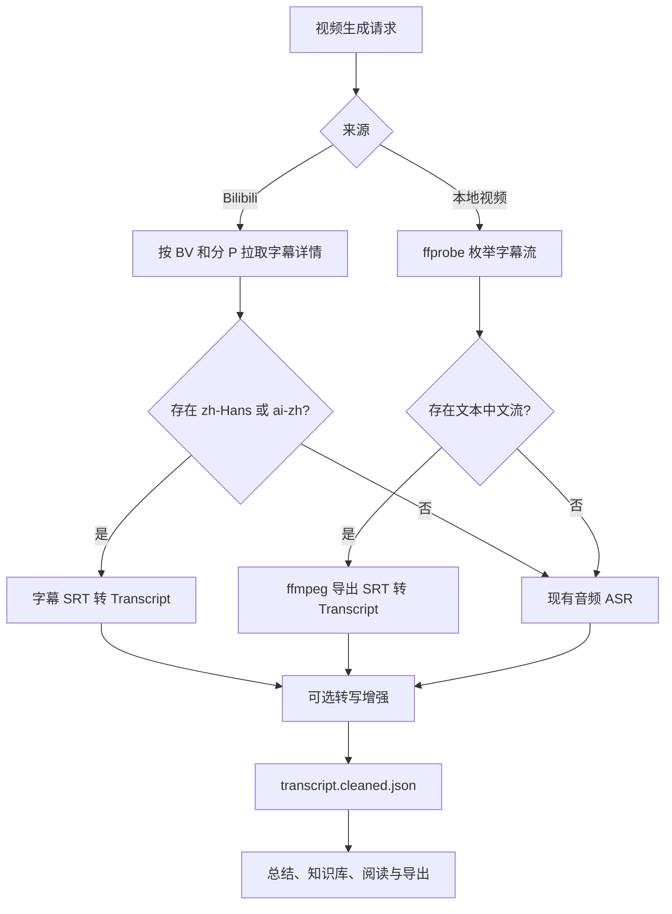

# Issue #57：视频内置字幕优先转写实施计划

## 目标

当视频已经提供可用的简体中文字幕时，直接把字幕转换为项目既有的
`Transcript`，跳过音频提取和 ASR；没有合格中文字幕时，保持现有
`ffmpeg -> faster-whisper/阿里云百炼 -> Transcript` 流程不变。

本次只处理两类**视频来源**：

1. Bilibili 链接的视频字幕。
2. 本地视频容器内的文本字幕流。

最终的总结、知识库、转写阅读和导出继续读取既有
`transcript.cleaned.json`，不为字幕新增并行的下游数据格式。

## 非目标

- 不新增独立 `.srt` 文件上传，也不增加新的 `source_type`。
- 不把英文、日文或其他语言轨道送入默认中文总结流程。
- 不对 PGS、VobSub、DVD subtitle 等图片字幕做 OCR。
- 不下载 Bilibili 视频后再扫描容器字幕；Bilibili 字幕应直接来自其字幕
  接口。
- 不移除或弱化 ASR；字幕只是一个优先的转写来源。
- 不把弹幕 XML 当作字幕。

## 已验证事实

### Bilibili / yt-dlp

项目运行环境已升级到 `yt-dlp 2026.07.04`。Bilibili 提取器会请求
`x/player/wbi/v2` 的字幕信息，并把 `subtitle_url` 返回的 JSON 转成内存
中的 SRT 文本。

通过项目 `.env` 中的登录 Cookie 验证：

| BV 号 | 可用轨道 | 验证结果 |
| --- | --- | --- |
| `BV12N4y1M7rh`（yt-dlp 官方测试样例） | `zh-Hans` | 成功取得非空 SRT |
| `BV1vJ3P6KEkh` | `ai-zh`、其他语言 | `ai-zh` 成功取得非空 SRT |
| `BV1NoTk6SERz` | `ai-en`、`ai-ja` | 无可接受中文轨道，应回退 ASR |

这里有一个必须保留的调用条件：对于 Python API，只有在
`YoutubeDL(..., listsubtitles=True)` 时，处理后的 `info["subtitles"]` 会保留
字幕条目及其 `data`（SRT 文本）。只设置 `skip_download=True` 并检查
`info["subtitles"]` 会得到错误的空结果。

当前 `src/backend/bilibili/ytdlp_bilibili.py` 的 `_extract_info()` 使用
`extract_flat="in_playlist"` 解析目录。该模式必须保持给解析系列/分 P 的
轻量用途，不能改成所有请求都抓取视频详情；字幕应有独立的按视频、按分 P
详情提取器。

### 本地视频

已用 `ffprobe` 识别 `mov_text` 流，并用：

```text
ffmpeg -i input.mp4 -map 0:s:0 output.srt
```

成功导出了可解析 SRT。文本字幕编码以 `subrip`、`webvtt`、`ass`、`ssa`、
`mov_text` 等为候选；`hdmv_pgs_subtitle`、`dvd_subtitle` 等图片字幕不进入
字幕转写路径，直接回退 ASR。

## 选择规则

默认只接受简体中文轨道，固定优先级如下：

1. Bilibili 原生 `zh-Hans`。
2. Bilibili AI 字幕 `ai-zh`。
3. 本地容器中标记为简体中文的文本字幕流。
4. 本地容器中标记为中文的文本字幕流；仅在没有更明确的简体标记时使用。
5. 没有候选或候选无法导出/解析时，回退 ASR。

以下情况一律不选：

- `danmaku`；
- `ai-en`、`ai-ja` 等非中文轨道；
- 本地流的语言标签为已知非中文；
- 图片字幕流；
- 空 SRT、无有效 cue、时间戳非法或无法解码的字幕内容。

语言匹配应由一个集中定义的规范化函数完成，处理 Bilibili 的 `zh-Hans` /
`ai-zh` 及 ffprobe 的 BCP 47 / ISO 639 标记；不可在调用点散落字符串判断。

## 目标数据流



字幕来源成功时，不调用 `probe_duration`、`extract_audio` 或
`Transcriber.transcribe`。视频时长从最后一个有效 cue 的结束时间得到；若
需要准确媒体时长而没有可用 cue，视为字幕解析失败并走 ASR，而不是混合两条
链路。

## 架构设计

### 1. 建立字幕转写来源端口

在 generation 层定义一个窄端口，例如：

```python
class TranscriptSource(Protocol):
    def load(self, video: VideoAsset) -> Transcript | None: ...
```

返回 `None` 表示“当前来源没有合格字幕”，不是错误；网络错误、媒体命令失败
和格式错误应带上下文抛出，由调用方记录后回退 ASR。不要把这些错误伪装成空
字幕，以免掩盖真实故障。

可提供两个实现：

- `BilibiliSubtitleTranscriptSource`：输入 BVID、分 P 与 Cookie 配置；返回
  原生 `zh-Hans` 或 `ai-zh` 的 SRT 转写。
- `EmbeddedSubtitleTranscriptSource`：输入本地视频路径；用 `ffprobe` 发现
  流并用 `ffmpeg` 导出选中的文本流。

SRT 到 domain `Transcript` 的解析器应为独立的纯函数/适配器，供两个来源共用。
它负责时间戳、cue 文本、空白行和排序校验；不要在 Bilibili 或 ffmpeg 适配器
中各自实现一份 SRT 解析。

优先使用成熟库 `srt` 完成 SRT 解析。它是解析依赖，不代表增加 SRT 上传功能。

### 2. 在生成用例中选择来源

`GenerateVideoSummary` 当前无条件执行：

```text
probe_duration -> extract_audio -> transcribe
```

将其重构为“先尝试字幕来源，再运行 ASR 回退”的单一分支：

```text
load subtitle transcript
    -> 成功：使用字幕的 Transcript 和 cue 结束时间创建 VideoAsset
    -> 未命中：执行现有 probe/extract_audio/transcribe
```

转写增强、`save_cleaned_transcript`、总结、原子提交和取消语义保持共有，避免
复制后半段流水线。

为了避免对非 Bilibili 本地视频调用网络来源，来源选择必须基于库中已有的
`source_path`、`bilibili_bvid`、`bilibili_page` 等事实，而不是 URL 文本猜测。

### 3. Bilibili 详情提取

在 `src/backend/bilibili/ytdlp_bilibili.py` 增加专用、可注入的字幕提取器：

- 构造对应分 P 的视频 URL。
- 使用 `skip_download=True`、`noplaylist=True`、`extract_flat=False`、
  `listsubtitles=True`。
- 复用现有 `_load_bilibili_headers`、Cookie 文件和代理解析逻辑。
- 为 `yt-dlp` 注入静默 logger，避免 `listsubtitles` 输出语言表污染后端 stdout。
- 从 `info["subtitles"]` 读取轨道；过滤 `danmaku`；按选择规则取一个轨道的
  `data`。
- `data` 必须是非空字符串；`url` 不能作为最终依赖，因为当前提取器已将其
  转为内存 SRT。

字幕查询只在用户触发某个视频生成时执行。系列导入与列表浏览继续复用 flat
解析，避免合集导入时对每一 P 额外请求详情。

### 4. 本地嵌入字幕提取

扩展 `FfmpegMediaProcessor` 或引入同级的专用字幕工具：

1. `ffprobe -show_streams -of json` 获取字幕流索引、codec、language、title。
2. 过滤文本编码与语言标签，按选择规则确定唯一流。
3. 使用绝对流索引 `-map 0:<stream-index>` 导出为临时 `.srt`。
4. 解析临时文件为 `Transcript`，文件位于现有 staging 目录并在结束时清理。

没有中文 language tag 的流不应盲目采用；这会把外语字幕混入中文总结。媒体
元数据无法证明中文时保守回退 ASR。

### 5. 缓存与制品

`GenerationStageCache` 当前以 `"whisper"` 和转写器 identity 缓存转写。字幕
应使用独立 stage key，例如 `"subtitle"`，身份至少包含：

- 来源种类（`bilibili` / `embedded`）；
- 选择器版本与语言优先级版本；
- Bilibili：BVID、分 P、选中语言、SRT 内容摘要；
- 本地：媒体文件指纹、字幕流索引、codec、language、字幕字节摘要。

缓存命中直接复用 `Transcript`。任何未命中或字幕不可用都不应复用旧字幕结果；
这时进入现有 Whisper stage。最终仍只保存既有 `transcript.cleaned.json`，无需
新增用户可见的字幕制品。

## 进度与错误语义

新增或调整的进度阶段：

| 阶段 | 成功时显示 | 失败/未命中时显示 |
| --- | --- | --- |
| `probe_subtitles` | 正在检查中文字幕 | 未找到可用中文字幕，改用语音识别 |
| `extract_subtitles` | 正在读取中文字幕 | 字幕读取失败，改用语音识别 |
| 既有 `probe` / `extract_audio` / `transcribe` | 仅 ASR 回退时出现 | 保持现有失败语义 |

“无可接受语言轨道”是正常未命中；Bilibili API 错误、Cookie 失效、yt-dlp 返回
无效结构、ffprobe/ffmpeg 执行失败及 SRT 格式错误必须在日志/进度详情中保留原因。
在明确记录后才允许 ASR 回退，不能静默吞掉错误。

## 实施顺序

1. 为 SRT 到 `Transcript` 编写纯解析器和单元测试；加入 `srt` 依赖。
2. 实现 Bilibili 字幕提取器及其轨道选择器，使用官方 BV 与用户样例的录制
   fixture 覆盖，不在单元测试中依赖实时网络。
3. 实现 ffprobe 流发现和 ffmpeg 导出，覆盖 `mov_text`、无语言标签、非中文、
   PGS 和导出失败。
4. 将两个来源接入 `GenerateVideoSummary`，保持 ASR 后半段代码只有一份。
5. 为 stage cache 增加字幕 stage 与 manifest identity。
6. 将新进度事件映射到 SSE/API/前端现有显示组件；不新增导入 UI。
7. 使用真实 Bilibili 样例做手工 smoke test，并完成完整自动回归。

## 测试矩阵

| 场景 | 输入 | 预期 |
| --- | --- | --- |
| Bilibili 原生简中 | `zh-Hans` SRT | 跳过 ASR，写出标准转写与总结 |
| Bilibili AI 简中 | `ai-zh` SRT | 跳过 ASR，使用 `ai-zh` |
| Bilibili 同时有原生简中与 AI 简中 | 两种轨道 | 固定选择 `zh-Hans` |
| Bilibili 仅英文/日文 | `ai-en`、`ai-ja` | 不使用字幕，运行 ASR |
| Bilibili 无轨道 | 仅 `danmaku` 或空 | 运行 ASR |
| Bilibili Cookie/API 失败 | 401/412/异常响应 | 记录原因并回退 ASR |
| 本地 `mov_text` 简中 | 标记为中文的文本流 | 导出、解析，跳过 ASR |
| 本地多语言字幕 | 中文和英文文本流 | 固定选择简中/中文流 |
| 本地仅外语文本字幕 | 英文/日文流 | 运行 ASR |
| 本地 PGS/VobSub | 图片字幕流 | 运行 ASR |
| 字幕损坏或无 cue | 非法/空 SRT | 记录原因并运行 ASR |
| 缓存命中 | 相同视频、轨道和规则版本 | 不重复请求/导出/ASR |
| 缓存失效 | 轨道、媒体或规则版本变化 | 重新取字幕，再决定是否回退 |
| 取消 | 字幕提取、ASR、总结任一阶段 | 清理 staging，不污染已提交制品 |

## 验收标准

1. `BV1vJ3P6KEkh` 生成时选择 `ai-zh`，且日志/进度证明没有执行音频提取和
   ASR。
2. `BV1NoTk6SERz` 不接受其 `ai-en`、`ai-ja`，完整走现有 ASR。
3. 官方 `BV12N4y1M7rh` 可读到 `zh-Hans` SRT，作为 Bilibili 提取器的手工
   兼容性样例。
4. 带 `mov_text` 中文流的本地 MP4 能直接生成总结；带 PGS 或无中文流的本地
   视频会回退 ASR。
5. 输出目录结构和 `transcript.cleaned.json` 格式与纯 ASR 生成保持兼容。
6. 不新增 SRT 文件导入入口、文件类型、前端表单或 `source_type`。
7. 后端单元测试、既有生成回归与前端进度相关测试全部通过。
